# E-shop - Book store
This is a store i created for my 5th project in the Code Institute Software Development Course. It is a simple book store with a small selection of books. It is called Dino's book store, after my cat. 

[live site](https://book-store-ci.herokuapp.com/)

## Creator goals
- Create a functioning e-commerse website with a search bar.
- Making it possible to add products and articles from the front-end.
- Giving the user the option to add a product to a wishlist.
- The user being able to contact the store directly from the website.

## UX - User Experience
### User Stories
Site user:
- Easily use and understand the website.
- Create account where they can see previous purchases.
- See products available. Including status and options.
- Add products to cart.
- Remove product from cart.
- Search for products.
- Navigate categories and get relevant results.
- Pay for products.
- Write reviews.

Admin user:
- Add/edit/remove products.
- See and cancel orders.
- Change stock numbers.

### Colour
I chose to make this e-store in blue- green shades. These colours were chosen due to it being a bit different than the online book-stores where i live (sweden), and due to a bluer green being appealing to the eye. The reason for the combination of the two was that it would help this store to differentiate itself from other similar stores, chich mostly use red or some shade of blue (for example royal blue). Another reason for my choice was the fact that the blue colour (according to, among others, the website [colour-meanings](https://www.color-meanings.com)) symbolices security and trust, and green symbolices harmony and safety. All the colour choices was checked in [accessibility checker](https://www.accessibilitychecker.org/color-contrast-checker/)'s contrast checker.

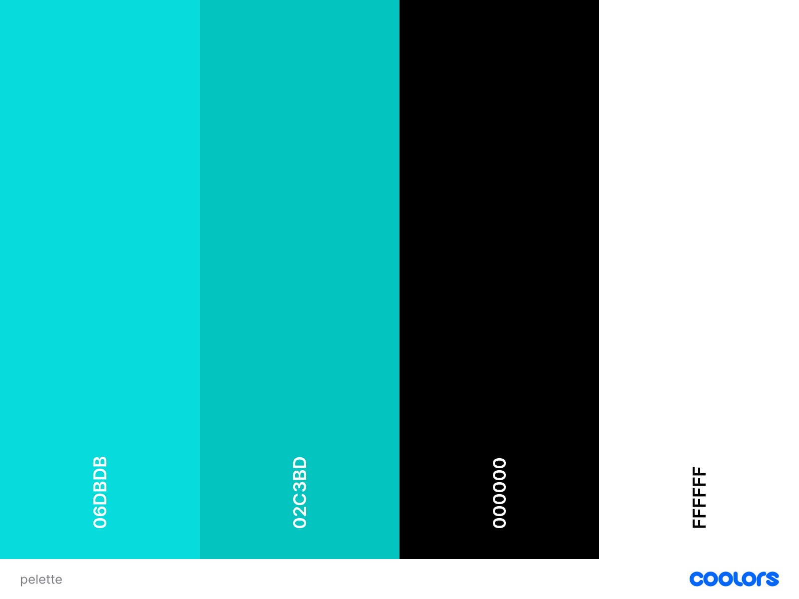
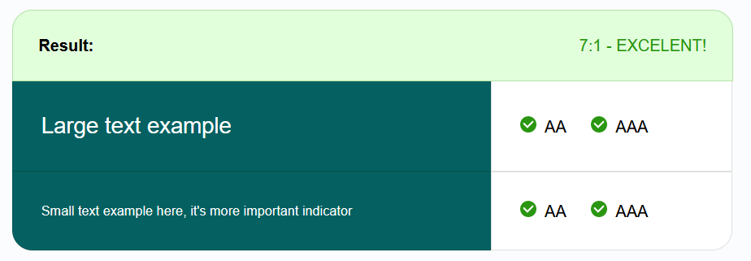
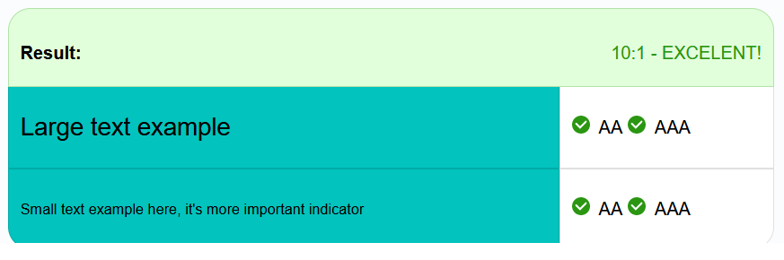

### Structure and typography 

#### Structure
I chose to create a simple structure, since the products are the thing that should attract attention. All products have a green background in the photos. This is so that they fit into the colour-palette while also attracting attention. Right below the navigation bar there is a darker field telling the user the name of the page. 

The base of the website is a simple navigation-bar with dropdown menues for products and accounts, and links for articles and home. These menues are in a dropdown-menue on the mobile version. I chose to place the search bar right below the dropdown menue and brand-name on the mobile view. That way there is no need to open a dropdown just to search for a product. The nav for medium screens are the same as the one for mobile, but with everything on one row.


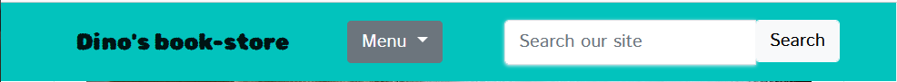
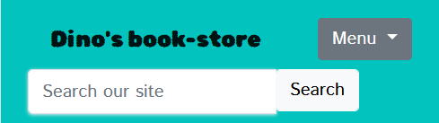

#### Typography
I chose to use the font "Rubik Bubbles" for the store name and main page titles. For everything else I used the font "Istok Web". Both of these are from [Google Fonts](). The fonts are also san-serif, which is easier to read on a screen than serif fonts.

The reason I chose these fonts were that they worked well with the colour palette. "Rubic Bubbles" is a softer font that also draws attention. "Istok Web" is inconspicous while also telling the user that effort was put into the website.

## Key models
These are some of the models in this project.

### Product
This model is for all the info needed for the products. It has fields for in example name, price, language, category and description. The category field is connected to the "Categories" model. This way the admin can create the categories needed once, and then give the category field in the products model the value of one of them.

### Article
The "article" models the name of the article, the author, the date it was last edited, and the article content.

### Checkout
When placing an order the checkout model will be used. It has both writable and non-writable object, depending on if the user needs to provide information or not. The payments are processed thru 

### Review
A review contains a score and a name. Every review is also connected to a product. These 3 are the fields in the model.

### Messages
The messages model is used for the contact form on the home page. It contains name, e-mail, message, and date. The model has a form connected to it.

## Features
### Shop
The products in the shop can be shown based on their categories or the user can choose to show all the products in alphabetic order. When all products in a category is show they are sorted alphabetically by default. From the product card you can go to the product detail page. This is where the user can add products to the shopping bag.

There is also a search bar where users can find products. 

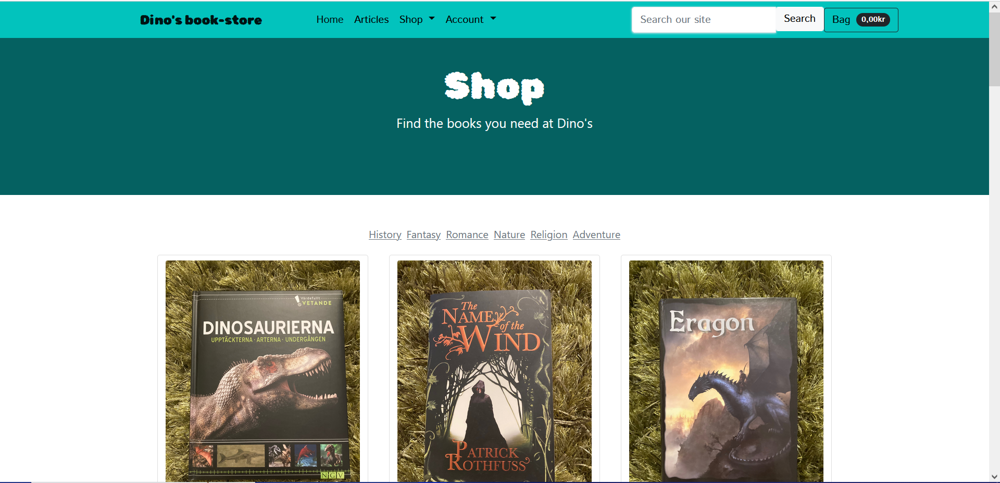

#### Product card
A product card is created for each product found on the database. Each card shows an image. Either a specific product image, or if none is found, a placeholder image telling the user that there is no product image. They also show the name of the product, the author and the price. There is also a button for opening the product details. Below the button there is some muted text telling the user if the item is in stock or not. 


#### Product details
When the user clicks on the button to get more information about a product, a page showing the information for the specific product opens. It shows the product image to the left, and all the other information about the product to the right (in the mobile view the image is above the information). Below the pruduct information is the quantity selector, "add to cart"/"out of stock" and "add to wishlist" buttons. If the stock numbers are below 1, the "out of stock" will show up. This button does not link to the shopping cart. If the product is in stock, the "add to cart" button will appear. This button will add the chosen quantity of an item to the cart. The wishlist button only appears if the user is signed in. 


At the bottom of the product details page, the user can see a review form and reviews. The reviews showing are only the one connected to the product on the page.

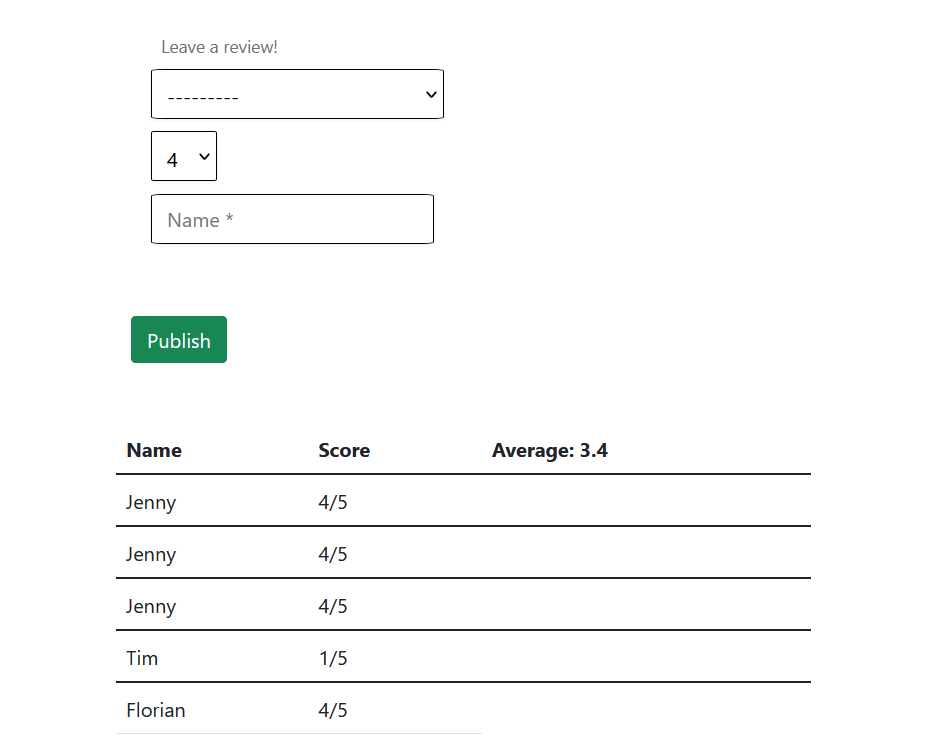

### Bag
The bag is a table with one row for each item. The row contains the product name (this links to the product detail page), the price of the product, the quantity and the total cost for the whole quantity. Below the name of the product there is red text saying "remove". When it is clicked on, it will remove the item from the bag.

Below the items there is information about the delivery cost, the product cost, and the total cost. The checkout button is below this, right by the "keep shopping" button. There is also a checkout button at the top.

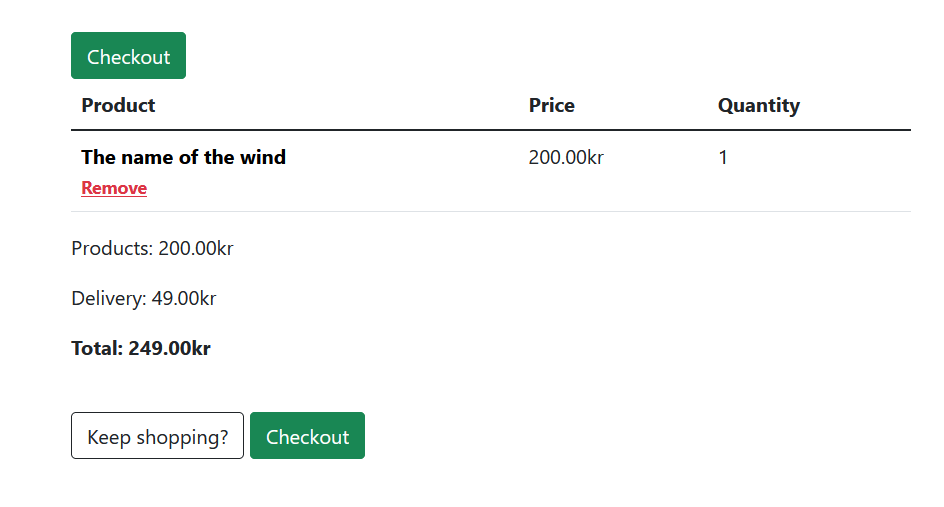

### Checkout
The checkout is where the user acctually places their order. It has a summary of the order, a form for giving all information needed for the delivery and , alost at the bottom, the payment field. At the bottom of the page, there is a button for placing the order, and a button for going back to the shopping bag (there is also one at the top).

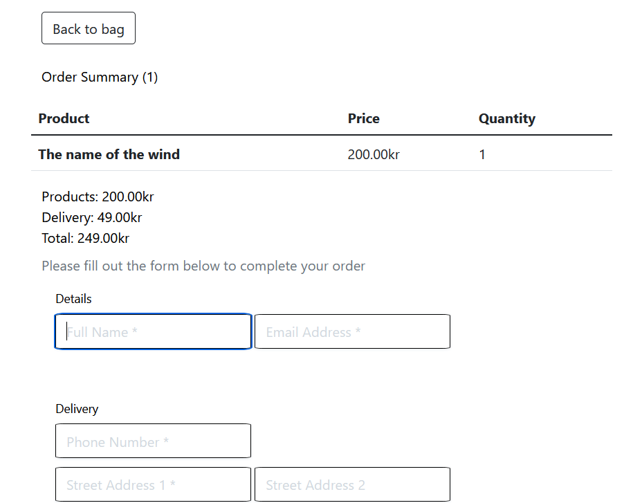

### Articles
The articles work similarly to the products. A preview of each article is shown on the articles page, and when the user click on an article they are sent to a page with the full article. The preview contains the title, the author, an introduction of the article (first paragraph), and a "read more" button. The page with the full article shows the title, author and full article.

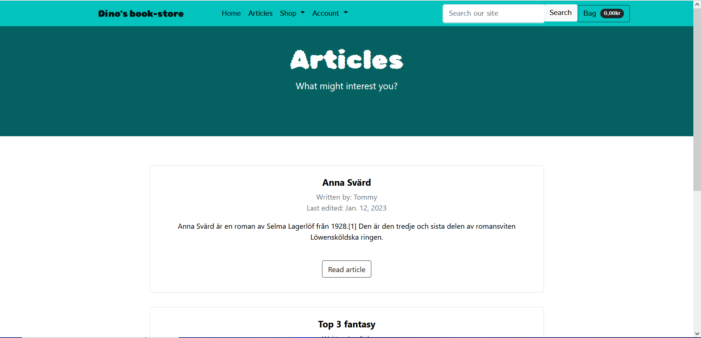

### Contact us
This is a form for sending a message to the people behind the e-shop. It can be found on the home page. The admin can see the messages people have sent on a "messages" page, only accessable by an admin. It used the messages model.

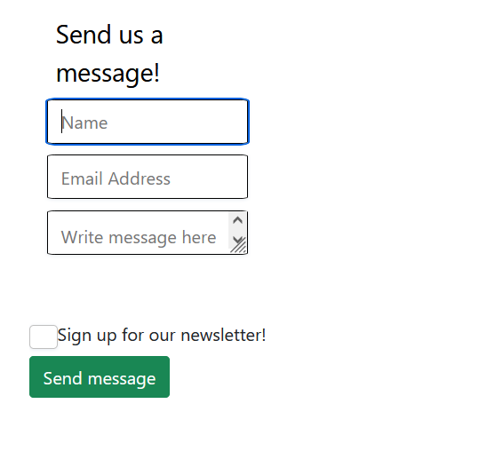

### Toasts
When a user does someting that returns a message, a toast pops up in the top right corner. It shows the message to the user. There are a few different toasts. Warning, eroor, success and info. Depending on what message is returned, a different toast is shown.

### Admin
The admin can add, edit and remove products thru the product management (add) and product detail (edit, remove) page. They input all the info about the books and then they show up in the category chosen. If needed they can also add more categories thru the admin page. The same goes for the articles.

Product management, and the messages from users can be accessed from the frontend.

### Potential Features
- If I had the time I would expand on the sorting options and other features making it easier for the user to find the right product.
- I would also want to expand on the admin features. For example, make it possible to answer incoming messages in the admin window. 
- Another thing that would be nice to have is the ability for the user to pay thru Swish or Klarna.

## Technologies and packages
This is the content of the requirements file, which explains what needs to be installed in order to run the code. Some of the installed packages are not used, but were used in earlier versions.

```
asgiref==3.6.0
boto3==1.26.45
botocore==1.29.45
Brotli==1.0.9
click==8.1.3
dj-database-url==0.5.0
Django==3.2
django-allauth==0.41.0
django-countries==7.2.1
django-crispy-forms==1.14.0
django-storages==1.13.2
Flask==2.2.2
Flask-SQLAlchemy==2.5.1
greenlet==2.0.1
gunicorn==20.1.0
itsdangerous==2.1.2
jmespath==1.0.1
oauthlib==3.2.2
Pillow==9.3.0
psycopg2==2.9.5
python3-openid==3.2.0
pytz==2022.7
requests-oauthlib==1.3.1
s3transfer==0.6.0
SQLAlchemy==1.4.45
sqlparse==0.4.3
stripe==2.42.0
Werkzeug==2.2.2
whitenoise==6.3.0
```

### Technologies

#### Languages
- HTML
- CSS
- JavaScript
- Python

#### Others
- [Bootstrap](https://getbootstrap.com/)
    - Used to create the frontend.
- [Django](https://www.djangoproject.com/)
    - Fullstack framework used for this project.
- [Stripe](https://stripe.com/se)
    - Handles payments.
- [AWS (S3)](https://aws.amazon.com/)
    - Used for storing static (css and js) and media (images) files.

## Testing

### User Stories
Site user:
- Easily use and understand the website.
    - The website has a pretty standard UI (user interface), which makes it easy for people to use.
- Create account where they can see previous purchases.
    - With the help of allauth, the user can create ann account, and on the "my profiles" page the users can see their previous purcheses (if the user was logged in at the time of the purchase).
- See products available. Including status and options.
    - The products page shows which products exist and if they are in stock or not. If the user is loged in, they can also add a product to their wish-list.
- Add and remove products in the cart.
    - The user can add products to the cart from the product-detail page. They can remove them from the bag by going to the bag and clicking "remove" on the item they no longer want.
- Search for products.
    - The user can search for products thru the search-bar. When this is done, the program searches for matches in, among others, the title and the description for the book. Only the books with a match to the search term shows up.
- Navigate categories and get relevant results.
    - In the shop dropdown the user can choose to either show all products, or show the products in a specific category. If the user chooses "history", only the history books will show up. 
- Pay for products.
    - This e-shop uses [stripe](stripe.com) for payments. The user write their card info, and stripe handles the transaction.
- Write reviews
    - On the product detail page, the user can add reviews (only score, not text). The reviews are then visible on the page for the relevant product.

Admin user:
- Add/edit/remove products.
    - Thru the admin page the admin has the option to easily add, edit and delete products. They just need to input the information about the book and add the product. Every piece of information is specified by the input field.
- See and cancel orders.
- Change stock numbers.
    - On the page where the admin can manipulate the products, there is a field for each product called "stock". Here the admin can input the available stock. If the stock is 0, the user can not add the item to their cart.

### Device Testing
The website was natively tested on these devices:
- Acer Aspire 5
- 1440p monitor (hooked up to a tower pc)


The website was also tested on these devices thru Mozilla Dev Tools:
- Ipad
- 

### Browser Testing
The website was tested on these browsers:
- Mozilla Firefox
- Google Chrome
- Safari
- DuckDuckGo (mobile)

### Peer Review
- I showed the front-end to my dad, and he thought it looked good. The thing he asked about was the lack of images, which I had not yet gotten to. Other than that he thought it looked good and was easy to use. 

### Validator Testing

### Manual testing
- Tested the models by creating instances. This was to make sure the fields looked like they should and that everything worked as expected.
- Tested if the database and the frontend was propperly connected by trying to show part of the data in the frontend. 
- Made sure the search bar works by searching for words found in book titles, descriptions, languages and authors. The expected results were showed.
- While implementing the add-to-bag functionality, I first printed the values of the items to the consol, to make sure everyhting was working. After that I could make sure everything was working thru the bag itself, since it shows both the item, the total price, delivery price and the quantity.
- For the remove-from-bag functionality, I tested if it worked in the same way I did the add-to-bag function.
- The checkout delivery forms system was tested in much the same way. the only difference was that i had to make sure it was not possible to access it with an empty shopping bag. I did that by trying to go to the checkout wkthout anything in the bag, and making sure I got sent back to the bag right away.
- The payment system was tested by making trial payments with the Stripe "test card". This card number is used for making test payments. Se the info about test payments [here](). After making the test payment, I checked on the dashboard to see if it went thru without issues or, if not, what the issue was.

### Software Testing
#### JavaScript Testing - Jest

#### Python Testing

### Bugs
#### Fixed Bugs
- I had a bit of trouble getting the product view to work. The products would not show up on the website. I solved it when i realised the problem was caused by a spelling error. After i fixed the spelling, it all worked as expected. I later had a similar problem when i implemented the ability to filter by category. The first letter in the category needed to be upper-case, which i had forgotten.
- When I wrote the link to the product_details of the bag items, I could not get the product id to work. After a while i realised that i had been referencing the wrong id. Had similar problems later in the project too.

#### Unfixed bugs
- It is possible to add more products than there is in stock to the bag. If you do all you get is a message saying you added a higher amount than the current stock and that the shipping of these products will be delayed due to this.
- If there is an image url, which does not work, the website will not show the substitution image. This is because the if-statememt only checks if there is an image url, not if it acctually works. the reason for this bug existing is time constraints. I prioritised larger issues before this. 

### Deployment
This project was deployed with Heroku.

- Create an account at Heroku, and do not forget you need to confirm your e-mail to do this.
- Create a list of dependencies in a text file named requirements (pip3 freeze > requirements.txt).
- Create an app by clicking the "create a new app" button found on the dashboard.
    - Choose a unique app name.
    - Choose your region and click "create app"
- Click on settings (for the app).
    - Find the Config Vars section and add potential files that you cannot upload to github. For example API credentials. KEY is the title, and VALUE is the content. For thos project you need to add the Django key and the database-url.
    - Add buildpacks (below Config Vars). For this project, I installed Python and Node.js. Make sure they are in the correct order.
- Go to the deploy section.
    - Choose to deploy from GitHub.
    - Connect your account and choose a repository to deploy from.
    - Choose either Automatic or Manual deployment (recommended).
- Add DISABLE_COLLECTSTATIC as a Config Var.

The database is on ElephantSQL.
- Create an account on ElephantSQL. Do not forget to confirm your e-mail.
- Click on "create a new instance" (it is a green button at the top right corner).
- Give the information about the instance.
    - Choose a name.
    - Choose a plan (tiny turtle is free, and the one i used for this project).
    - Add potential tags (not necessary)
    - Select a region and data center. Choose one close to you for the best connection.
- Preview the information to make sure everything is correct.
- Create instance.
- Click on your instance to see the information. 
- Copy the url and add it to the Config Vars as DATABASE_URL.
- Add the following code instead of the earlier database settings in settings.py:
```
if 'DATABASE_URL' in os.environ:
    DATABASES = {
        'default': dj_database_url.parse(os.environ.get('DATABASE_URL'))
    }
else:
    DATABASES = {
       'default': {
            'ENGINE': 'django.db.backends.sqlite3',
            'NAME': os.path.join(BASE_DIR, 'db.sqlite3'),
        }
    }
```
- Go to elephantSQL and go to the "BROWSER" tab. Choose auth_user from table querries. Then click execute.
- Migrate the models to the database and make sure everything is working.

For the static files I used AWS S3:
- Create an Amazon AWS account.
- Search for S3 and create a new bucket.
    - Allow public access.
- Go to Properties > Static website hosting.
   - Click on the following:
    Enable > index.html as index.html > save.
- Go to Permissions > CORS and copy the following:
```
[
  {
      "AllowedHeaders": [
          "Authorization"
      ],
      "AllowedMethods": [
          "GET"
      ],
      "AllowedOrigins": [
          "*"
      ],
      "ExposeHeaders": []
  }
]
```

- Go to Permissions > Bucket Policy.
    - Generate a Bucket Policy and take note of Bucket ARN.
    - Chose S3 Bucket Policy as Type of Policy.
    - Enter * as principle.
    - Enter ARN from the note mentioned above.
    - Add Statement.
    - Generate the Policy.
    - Copy the Policy JSON Document.
    - Paste the policy into Edit Bucket policy on the previous tab.
    - Save the changes.
- Go to ACL (Access Control List).
    - Choose List for everyone (public access).
    - Accept that everyone can access the Bucket.
    - Save the changes.
- AWS IAM (Identity and Access Management) setup.
    - From the IAM dashboard within AWS, select User Groups
    - Create a group. Click through and Create Group.
- Select Policies.
    - Create a policy.
    - Go to the JSON tab and click "Import managed policy".
    - Choose AmazongS3FullAccess.
    - Edit the resource to include the Bucket ARN from earlier (when you created the Bucket Policy).
    - Click next step, go to Review policy.
    - Give the policy a name and description.
    - Create the policy.
- Go to User Groups and choose the group you created.
    - Go to Permissions > Add permissions.
    - Attach Policies and select the one just created
    - Add permissions.
- Go to Users.
    - Choose a user name.
    - Select Programmatic access as the Access type.
    - Add the user to the Group just created.
    - Create User.
- Download the .csv file containing the access key and secret access key.
    - The file can only be downloaded once.

- Connecting Heroku to AWS S3

Install boto3 and django-storages by typing these commands in the terminal:
```
pip3 install boto3
pip3 install django-storages
pip3 freeze > requirements.txt
```

- Add the values from the .csv to your Heroku Config Vars.
- Delete the DISABLE_COLLECTSTATIC variable from your Config vars. 
- Deploy your Heroku app.

- Now, you can create a new folder called media (at the same level as the newly added static folder) and upload any required media files to it.
    - Make sure the permissions are correct.


## Credits
### Code
A lot of the backend code is based on the [boutique ado](https://github.com/Code-Institute-Solutions/boutique_ado_v1) project from the Code Institute fullstack developer course. The code is adapted to fit my project.

For the frontend I used the [Shop Homepage](https://startbootstrap.com/template/shop-homepage) from [Start Bootstrap](https://startbootstrap.com). It is used for the navbar and footer, as well as for the product cards.

Some of the code is based on the code snippets provided in the [bootstrap](), and [django]() documentation.

### Content and Media
When writing the README.md, i used my mentor Harry Dhillon's [Nourish and Lift project](https://github.com/Harry-Leepz/Nourish-and-Lift) as a guide. All pictures on the website are taken by me, and information about who wrote and published the book can be found on the [live site](https://book-store-ci.herokuapp.com/) on each book's product page. The publisher can be seen on the covers. The description for the books also tells the user where the description was copied from. 

Erik Vodopivec Forsman, 2022
