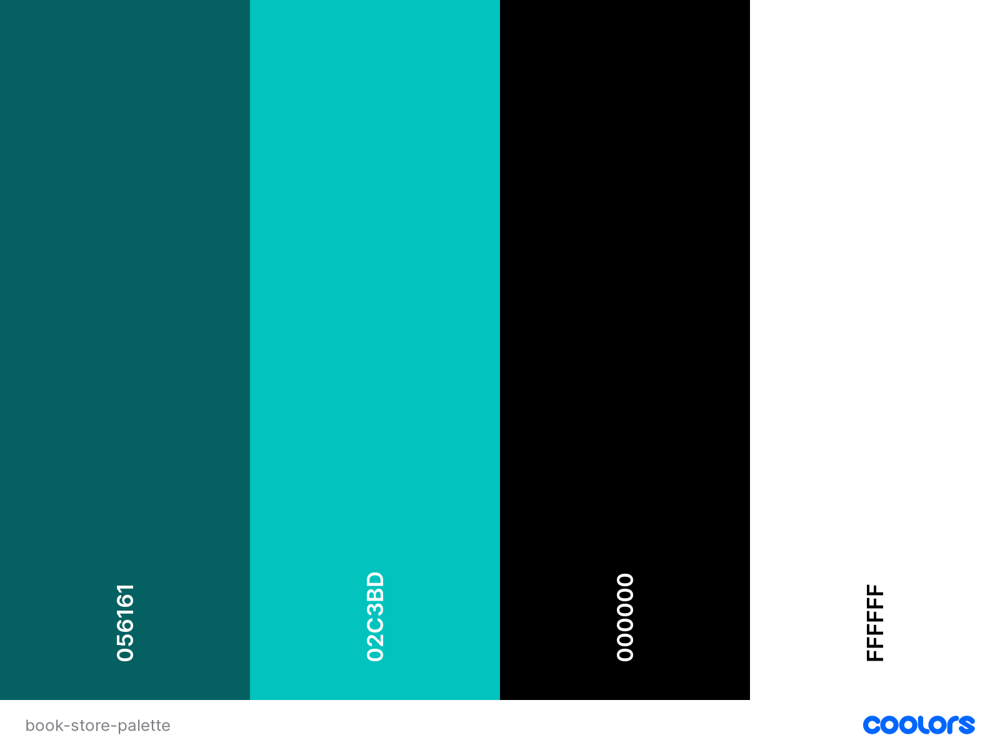

# E-shop - Book store

## UX - User Experience
### User Stories
Site user:
- Easily use and understand the website.
- Create account where they can see previous purchases.
- See products available. Including status and options.
- Add products to cart.
- Search for products.
- Navigate categories and get relevant results.
- Pay for products.

Admin user:
- Add/edit/remove products.
- See and cancel orders.
- Change stock numbers.

### Colour
I chose to make this e-store in blue and green shades. These colours were chosen due to it being a bit different than the online book-stores where i live (sweden), and due to blue being appealing to the eye. The reason for the combination of the two was that it would help this store to differentiate itself from other similar stores, chich mostly use red or some shade of blue (for example royal blue). Another reason for my choice was the fact that the blue colour (according to, among others, the website [colour-meanings](https://www.color-meanings.com)) symbolices security and trust, and green symbolices harmony and safety. All the colour choices was checked in [accessibility checker](https://www.accessibilitychecker.org/color-contrast-checker/)'s contrast checker.

### Structure and typography 

#### Structure

#### Typography
I chose to use the font Pacifico for the store name and page titles. For everything else I used the font . Both of these are from [Google Fonts](). The fonts are also san-serif, which is easier to read on a screen than serif fonts.

the reason I chose these fonts were that they fitted the colour palette. 

## Features

### Potential Features

## Testing

### User Stories

### Device Testing

### Browser Testing

### Peer Review

### Validator Testing

### Software Testing
#### JavaScript Testing - Jest

#### Python Testing

### Bugs
#### Fixed Bugs

#### Unfixed bugs

### Deployment
This project was deployed with Heroku.

- Create an account at Heroku, and do not forget you need to confirm your e-mail to do this.
- Create a list of dependencies in a text file named requirements (pip3 freeze > requirements.txt).
- Create an app by clicking the "create a new app" button found on the dashboard.
    - Choose a unique app name.
    - Choose your region and click "create app"
- Click on settings (for the app).
    - Find the Config Vars section and add potential files that you cannot upload to github. For example API credentials. KEY is the title, and VALUE is the content. For thos project you need to add the Django key and the database-url.
    - Add buildpacks (below Config Vars). For this project, I installed Python and Node.js. Make sure they are in the correct order.
- Go to the deploy section.
    - Choose to deploy from GitHub.
    - Connect your account and choose a repository to deploy from.
    - Choose either Automatic or Manual deployment (recommended).
- Make sure the live site is working.

## Credits
### Code
A lot of the backend code is based on the [boutique ado](https://github.com/Code-Institute-Solutions/boutique_ado_v1) project from the Code Institute fullstack developer course.

For the frontend I used the [Shop item template](https://startbootstrap.com/template/shop-item), and the [Shop Homepage](https://startbootstrap.com/template/shop-homepage) from [Start Bootstrap](https://startbootstrap.com). The first one is used for the specific items, and the second one is for the shop page.

### Content and Media
All pictures of the books are taken by me, and information about who wrote and published the book can be found on the [live site]() on each book's product page.

Erik Vodopivec Forsman, 2022
